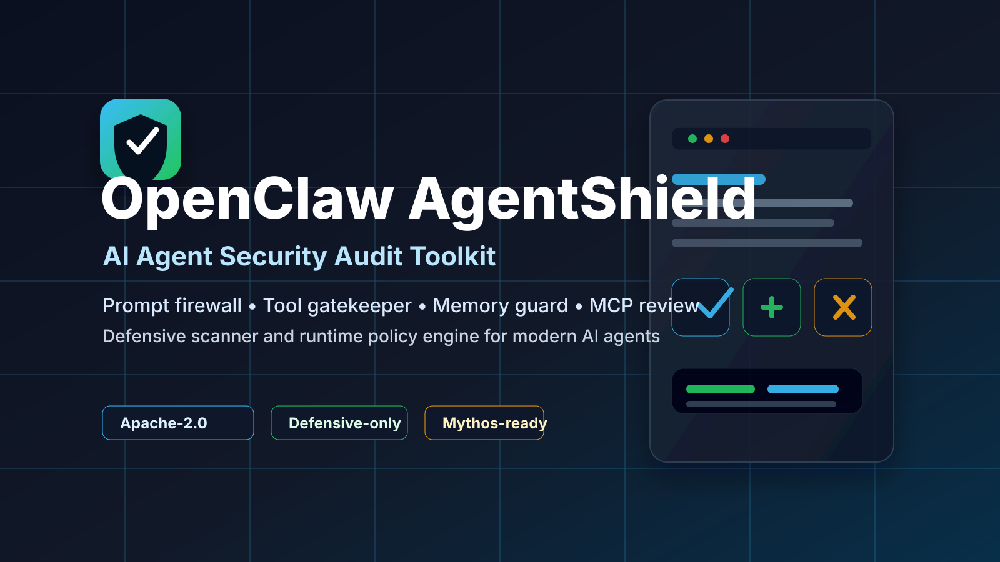

# OpenClaw AgentShield



AI Agent Security Audit Toolkit for teams deploying AI agents, LLM apps, RAG workflows, tool-using assistants, and autonomous automations.

AgentShield is a defensive local scanner and policy toolkit that helps buyers find risky instructions before AI agents ingest files, save memory, run tools, or pass context to another agent.

## Positioning

OpenClaw AgentShield is a Mythos-ready AI Agent Security Audit Toolkit: a scanner, runtime policy engine, and reporting layer that helps organizations defend against prompt injection, malicious tool calls, memory poisoning, data exfiltration, unsafe agent-to-agent communication, risky autonomous actions, over-permissive MCP/tool connectors, approval fatigue, and weak egress controls.

Marketing phrase: antivirus-style auditing for AI agents.

Technical phrase: AI Agent Security Audit Toolkit and Runtime Policy Engine.

## Buyer Pain Point

Companies are starting to connect AI agents to documents, emails, internal tools, databases, APIs, files, browsers, SaaS platforms, and other agents. Traditional antivirus and web application firewalls were not designed for natural-language instructions hidden in webpages, PDFs, emails, support tickets, GitHub issues, chat logs, tool output, memory records, or agent skill files.

The risk is no longer only "bad chatbot output." The risk is an agent reading untrusted content, accepting hidden instructions, then using legitimate tools to leak data, alter records, call APIs, approve actions, poison memory, or instruct another agent.

## Defensive Scope

This product is defensive-only. It does not provide exploitation playbooks, credential theft methods, stealth workflows, persistence techniques, unauthorized access instructions, or attack automation.

It focuses on:

- enterprise AI risk assessment
- prompt-injection detection
- agent permission control
- tool-call governance
- sensitive-data protection
- memory and RAG poisoning prevention
- agent audit trails
- compliance-ready reporting
- MCP/tool-manifest review
- autonomy and approval-fatigue risk detection
- safe red-team simulation without operational abuse instructions

## MVP Modules

1. Prompt Firewall
2. Tool Gatekeeper
3. Context Isolation Layer
4. Memory Guard
5. Agent-to-Agent Firewall
6. RAG and Document Scanner
7. Enterprise Audit Log
8. Red-Team Simulation Harness

## Initial Deliverables

- `research/threat-landscape.md`: verified defensive threat landscape and sources.
- `product/product-blueprint.md`: product architecture, modules, buyer value, and MVP.
- `docs/release-audit-checklist.md`: commercial readiness checklist.
- `docs/buyer-quickstart.md`: external buyer setup and usage guide.
- `docs/sales-page-copy.md`: Gumroad-ready sales page copy.
- `docs/gumroad-listing.md`: ready-to-paste Gumroad product listing.
- `docs/final-release-audit.md`: final buyer-facing release audit.
- `docs/mythos-ready-agent-security.md`: upgraded enterprise guide for frontier agent risk, containment, MCP/tool review, and approval fatigue.
- `agentshield/`: first defensive CLI scanner MVP.
- `policies/default-policy.json`: configurable default policy rules.
- `tests/`: scanner behavior tests.

## Commercial Promise

AgentShield should not promise impossible "bulletproof" protection. The enterprise-grade promise is layered reduction of AI-agent risk through isolation, least privilege, policy enforcement, scanning, logging, human approval gates, and continuous testing.

## License

OpenClaw AgentShield is released under the Apache License 2.0. See `LICENSE`.

## Quick Start

Requirements:

- Python 3.10 or newer
- Terminal access on macOS, Linux, or Windows PowerShell
- No cloud account required

From the product folder, run:

```bash
python3 -m agentshield.cli examples/benign-request.txt --pretty
```

Scan a risky memory update:

```bash
python3 -m agentshield.cli examples/risky-memory-write.txt --pretty
```

Scan a directory and write JSON plus Markdown reports:

```bash
python3 -m agentshield.cli examples --pretty --report reports/examples-scan.json --markdown-report reports/examples-scan.md
```

Use a policy file:

```bash
python3 -m agentshield.cli examples --policy policies/default-policy.json --pretty
```

Fail a CI/checklist step when risky content is found:

```bash
python3 -m agentshield.cli examples --fail-on-risk
```

Run tests:

```bash
python3 -m unittest discover -s tests
```

## What The Decisions Mean

- `allow`: no issue detected by the current rules.
- `quarantine`: keep this content away from privileged agent context.
- `approval_required`: human review is required before action.
- `block`: do not allow this content or requested action to proceed.

## Buyer Workflow

1. Scan prompts, documents, logs, memory files, and agent context before ingestion.
2. Save JSON and Markdown reports as audit evidence.
3. Review `quarantine`, `approval_required`, and `block` results.
4. Tune `policies/default-policy.json` to match the buyer's internal approval process.
5. Add `--fail-on-risk` to CI, pre-deployment checks, or manual release gates.

## Troubleshooting

If `python3` is not found, try `python` instead.

If reports are not created, make sure the destination folder path is writable. AgentShield creates parent folders for report and audit-log paths when needed.

If a scan returns `block` or `approval_required`, open the JSON or Markdown report and review the `findings` list. Each finding includes a rule ID, category, severity, decision, description, and short evidence snippet.

Mythos-ready reports also include impact and recommended fix fields so buyers can move from detection to practical governance action.

If the scanner misses a company-specific risk phrase, add or adjust rules in `policies/default-policy.json`.
